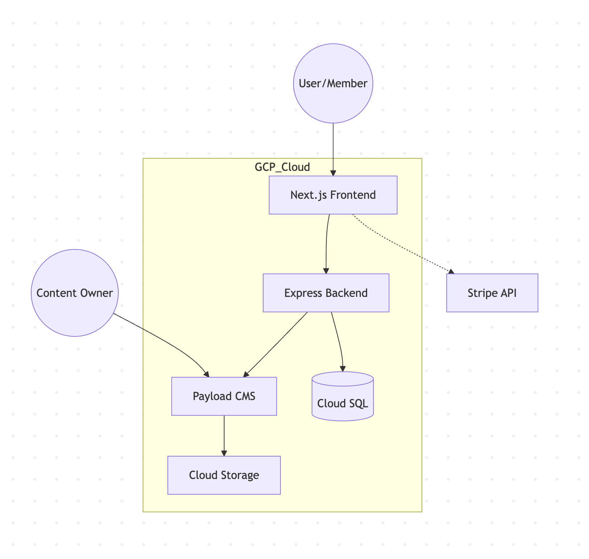
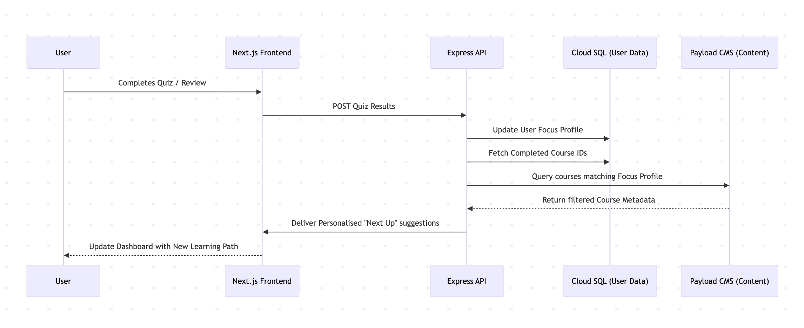

# Case Study: Gamified Life Coaching & Dynamic Course Portal

### Context
The project involved building a high-performance, subscription-based learning platform. The goal was to deliver a personalised experience where course recommendations and "gamified" goals were dynamically generated based on user quiz results and focus areas.

### Technical Solution
I architected a decoupled full-stack application hosted on **Google Cloud Platform (GCP)**. The system uses **Next.js** for a high-performance frontend and a **Node.js/Express** backend to manage complex business logic, gamification engines, and secure data persistence.

* **Frontend**: Next.js (SSG for public site, SSR for member portals).
* **Backend**: Node.js & Express (RESTful API).
* **CMS**: Payload CMS (Headless) for content authoring and course management.
* **Database**: Managed PostgreSQL on GCP (Cloud SQL).
* **Infrastructure**: GCP (App Engine/Cloud Run), Cloud Storage for media.
* **Integrations**: Stripe (Billing), Auth0 or Firebase (Identity).

---

### System Architecture

### Data, Security & Dynamic Logic

**1. The Suggestion Engine (Tag-Based Matching)**

Content is not static; it is "suggested" based on a user's Focus Profile.

Metadata Layer: In Payload CMS, every module is tagged by focus area (e.g., stress-reduction) and difficulty level.

Logic Flow: When a user completes a quiz, the Express backend updates their profile in Cloud SQL. The API then performs a cross-reference query against the CMS to return the most relevant next steps.

**2. Sequence Diagram**

**3. Security & Data Privacy**
* RBAC & Content Gating: I implemented strict Role-Based Access Control. The Express API verifies Stripe subscription status before fetching content from the CMS, ensuring proprietary material is never exposed to non-paying users.

* Signed Media URLs: Video assets in GCP Cloud Storage are served via time-limited signed URLs generated by the backend, preventing direct link sharing.

* Server-Side Validation: All gamification XP and quiz evaluations are calculated on the server to prevent client-side manipulation.

### Key Features

* Gamified Progress Tracking: A custom engine that tracks "streaks" and rewards users with badges (SVG-based with ARIA live region support).

* WCAG 2.2 Compliance:

    * Implemented keyboard-accessible quiz interfaces and focus-trapped modals.

    * Ensured dynamic dashboard updates are announced to screen readers using aria-live="polite".

* Mobile-First UX: Next.js Parallel Routes used to provide a seamless, app-like experience for members on the go.

### Quality Strategy

**Integration Testing:** Used Supertest to verify that the Express backend correctly handles unauthorised requests to protected content.

**E2E Automation:** Playwright suites cover the "User Journey": Registration -> Subscription -> Quiz -> Course Access.

**Accessibility Audits:** Continuous testing with Axe-core integrated into the CI/CD pipeline.